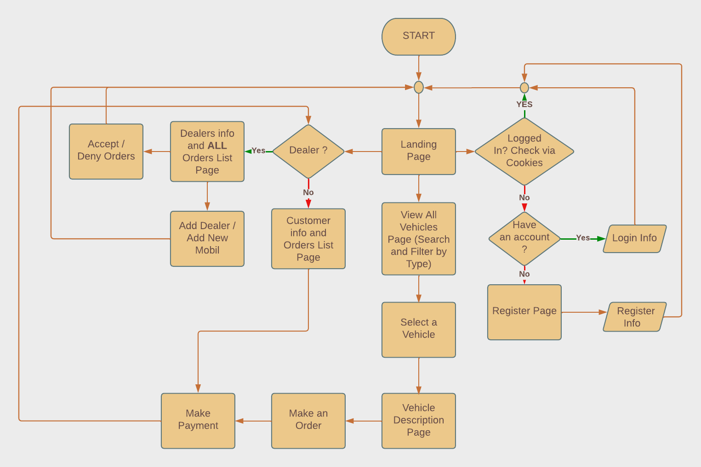
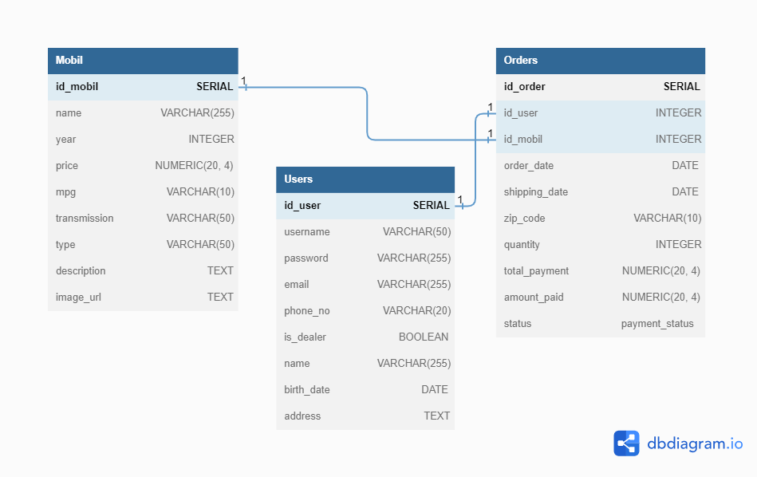

## CarGo
CarGo: is a Node.js-based car dealership website. The website allows users to view car inventory, compare car features, and make purchases. Additionally, users can perform searches based on specific criteria. The website provides login and registration features for users to make online payments.

## Team
This is a Database Management System (DBMS) project made by group W23
- Eriqo Arief
- Juan Jonathan
- RBS Kresna Ramdani

## Overview
This website is a platform that provides buyers to purchase cars. Potential buyers could search from myriad of cars that has been provided by our dealer. There are two roles in this website which are **Buyer** and **Dealer**. Both of these role has their own features that could be used in our website.

# Here are things that a buyer could do
- Register an account and use it to login.
- Search for a car based on their types.
- Compare car features and perform searches based on specific criteria.
- Select a car for purchase and make online payments.
- Review previous order on their account page.

# Here are things that a dealer could do
- Register a new dealer
- Add new cars into the catalogue
- Review incoming order and could deny or accept the order.

## Entities/Tables

### 1. ```Car```
The Mobil table represents the car inventory in the dealership system. It stores information about various car models such as their names, manufacturing years, prices, fuel efficiency (miles per gallon), transmission types, categories, descriptions, and image URLs. This table helps in managing and organizing the available cars for sale. Here are the columns stored by this table:
1. car_id
2. name
3. year
4. price
5. mpg
6. transmission
7. type
8. description

### 2. ```User```
The Users table is responsible for storing user information within the system. It includes details such as usernames, passwords, email addresses, phone numbers, and user roles (whether they are dealers or not). Additionally, it holds user-specific data like names, birth dates, and addresses. This table helps in managing user accounts and their associated information. Here are the columns stored by this table:
1. user_id
2. username
3. password
4. email
5. phone_number
6. is_dealer
7. name
8. birth_date
9. age
10. address

### 3. ```Order```
The Orders table is used to track the orders placed by users for car purchases. It links the orders to the respective users and car models through foreign key references. The table records information such as the order date, expected shipping date, shipping ZIP code, quantity of cars ordered, total payment amount, amount already paid, and the current payment status. Here are the columns stored by this table:
1. order_id
2. user_id
3. car_id
4. order_date
5. shipping_date
6. zip_code
7. quantity
8. total_payment
9. amount_paid
10. amount_left

## ERD
---


## Flowchart
---



## UML
---



## Progress Report

https://youtu.be/BZZVEqzqqug

https://www.youtube.com/watch?v=BZZVEqzqqug
